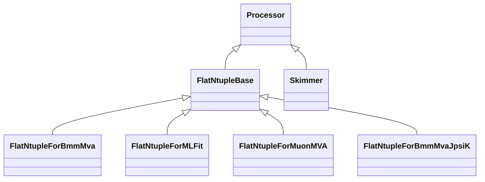

# Bmm5 post processing scipts

## Introduction

Bmm5 analysis uses many different samples for a varity of studies and
measurements. It is more efficient to have samples optimized for a
specific task than using NanoAOD as universal input. A full set of
NanoAOD samples is of the order of 1TB in size and processing such
volume of data requires a batch system or long processing, which
introduce delays.

There are two main types of post processors:
- Skimmer - used to select a small subset of events keeping NanoAOD format
- FlatNtuple - simple tabular data format targetting a specific study containing small number of variables

## Installation

In order to postprocess (skim) NanoAOD we need https://github.com/cms-nanoAOD/nanoAOD-tools
```shell
cd $CMSSW_BASE/src
git clone https://github.com/cms-nanoAOD/nanoAOD-tools.git PhysicsTools/NanoAODTools
cd PhysicsTools/NanoAODTools
cmsenv
scram b
```

## Design

### Processors

- Skimmer - generic skimmer using ROOT-style cuts
- FlatNtupleForMLFit - "small" ntuples used for UML fit
- FlatNtupleForBmmMva - ntuples for Bmm MVA training
- FlatNtupleForBmmMvaJpsiK - ntuples for Bmm MVA training using BuToJpsiK events reconstructed as Bmm
- FlatNtupleForMuonMVA - ntuples for Muon Id MVA training

### Resource Handlers

Main goal is to hide resource specific job handling from other parts
of the code. Soupported resources:
- LocalResourceHandler - run jobs locally
- SSHResourceHandler - run jobs on a remote server that can be accessed without password

### Processing Strategy
- JobCreator 
  - Read the config file to understand the task
  - Find unprocessed files
  - Create jobs
- JobDispatcher 
  - Check available resources
  - If resources are available and new jobs are present - submit the jobs
  - Waits for jobs to finish

### Config files

- postprocessing_cfg.py - main config file to specify tasks
- resources_cfg.py - resource config file
